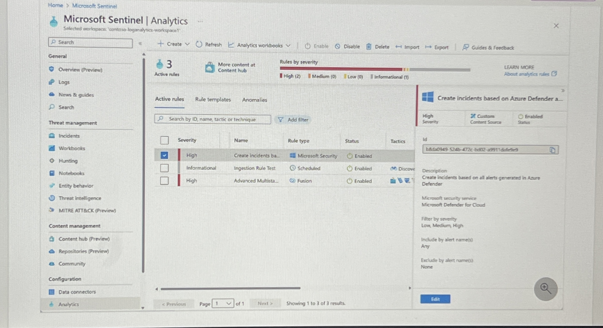

# Microsoft Azure Sentinel + ServiceNow Mini Lab

## Overview
This mini-project demonstrates how Microsoft Azure Sentinel can detect suspicious activity and integrate with ServiceNow for incident management. The goal is to simulate a basic SOC workflow using cloud SIEM detections and ITSM ticketing.

## Objectives
- Deploy Microsoft Azure Sentinel with a test log source
- Create two detection rules:
  1. Failed Login Attempts
  2. Suspicious IP Geolocation
- Simulate incident tracking in ServiceNow

## Setup
1. Create an Azure Free Account and enable **Microsoft Sentinel** on a Log Analytics Workspace.
2. Connect a test log source (e.g., Azure Activity Logs).
3. Create detection rules:
   - **Failed Logins**: Trigger after multiple failed sign-ins.
   - **Suspicious IP**: Trigger on sign-ins from unusual geolocations.

## MITRE ATT&CK Mapping
- **Failed Logins** → T1110 (Brute Force)  
- **Suspicious IP Geolocation** → T1078 (Valid Accounts)

## Project Screenshots

### 1. Sentinel Overview – Collect, Detect, Investigate, Respond

### 2. Data Connectors

### 3. Analytics Rules

### 4. Logs / KQL Queries

---

## ServiceNow Workflow (Simulated)

When alerts are triggered in Sentinel, a mock ServiceNow ticket is generated for tracking and escalation.

| Field       | Value                                   |
|-------------|-----------------------------------------|
| Incident ID | INC-1001                                |
| Source      | Microsoft Sentinel (Failed Logins)      |
| Assigned To | SOC Analyst                             |
| Priority    | P3                                      |
| Status      | Resolved                                |
| Resolution  | Account locked; password reset enforced |

## Conclusion
This lab demonstrates how SOC teams can use Microsoft Azure Sentinel for cloud-based threat detection and ServiceNow for streamlined incident management.
